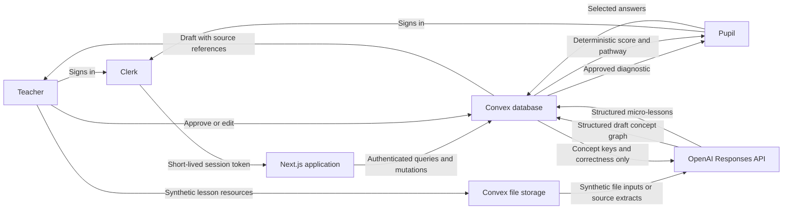

# Safety, privacy, and product decisions

- **Status:** Build Week prototype policy
- **Last reviewed:** 14 July 2026
- **Current data scope:** Synthetic data only

## Purpose

This document explains why BridgeBack handles pupil data and AI decisions in the way it does. It is written for judges, developers, educators, safeguarding leads, data protection officers, and anyone evaluating whether the product should progress beyond a prototype.

BridgeBack is designed for pupils returning to lessons after absence. That makes its intended users children, and it places the product in an educational setting where pupils may have limited choice over the tools their school adopts. The project therefore treats the best interests of the child, data minimisation, meaningful teacher oversight, and protection from inappropriate automated decisions as design requirements rather than optional compliance work.

This document is an engineering and product record, not legal advice. A real-school deployment would require qualified legal, safeguarding, information-security, and data-protection review.

## Current prototype boundary

The Build Week demonstration uses only fictional people and synthetic educational records:

- **Mia** is a fictional Year 10 pupil.
- **Ms Morgan** is a fictional teacher.
- Attendance history, lesson resources, diagnostic responses, learning gaps, and classroom data are invented.
- Demo Clerk accounts must not use the name, email address, work, or attendance history of a real child or teacher.
- Uploaded demo resources must be fictional, openly licensed, or owned by the person uploading them. They must not contain real pupil information.

The prototype is not approved to process live school data. Synthetic data reduces risk during development, but it does not make the architecture automatically suitable for production.

## Principles

### Put the child's interests first

The ICO Children's code says the best interests of the child should be a primary consideration for services likely to be accessed by children. It also calls for high-privacy defaults, data minimisation, appropriate transparency, and a data protection impact assessment (DPIA). BridgeBack adopts these principles even where the precise legal scope of the code would need to be assessed for a future school deployment.

### Prepare for the next lesson, not reconstruct a pupil's life

BridgeBack needs to understand the learning prerequisites of an upcoming lesson. It does not need to know why a pupil was absent. Medical details, family circumstances, safeguarding history, disability or special educational needs status, behavioural records, and emotional state are outside the product's current purpose.

### Support educational judgment; do not replace it

AI may draft a concept graph, questions, and explanations. A teacher reviews the dependency graph before it can be assigned. Deterministic application code grades multiple-choice answers and selects prerequisite concepts. BridgeBack must not autonomously decide grades, placement, disciplinary action, attendance consequences, access to education, or whether a pupil is capable of participating.

### Show the smallest useful amount of information

The pupil sees no more than three next steps. The purpose is to make re-entry manageable, not to expose a long deficit list or create a permanent profile of perceived weaknesses.

### Make limitations visible

Pupils are told that the check-in is not a test, grade, or definitive measure of mastery. Teachers see that AI-generated graphs are editable and require review. Future AI-generated explanations must be labelled and must provide a way to report a concern.

## Data flow

The lesson-analysis model is not given the pupil's name, reason for absence, attendance record, diagnostic history, or Clerk account details. Lesson analysis is independent of the identity of the pupil who may later use it. When pupil micro-lessons are generated, the model receives only the approved concept path and a minimal list of concept keys plus whether the corresponding closed diagnostic response was correct. It does not receive the pupil's name, selected answer, attendance record, or absence reason.

## Data inventory

| Data category | Prototype example | Purpose | Sent to OpenAI? | Current store |
| --- | --- | --- | --- | --- |
| Identity | Synthetic Clerk subject, display name, role | Authentication and authorization | No; only a one-way hash is used as a safety identifier for the requesting teacher | Clerk and Convex |
| Class membership | Mia enrolled in synthetic class 10C | Give each role access to the correct demo data | No | Convex |
| Lesson metadata | Binary search, objectives, date | Identify the upcoming lesson | Yes, when analysis is requested | Convex; request processed by OpenAI |
| Lesson resources | Synthetic slides and worksheets | Ground prerequisite extraction | Yes; supported files are sent directly as request-scoped `input_file` content and seeded resources use synthetic text extracts | Convex storage; request processed by OpenAI |
| Illustration context | Concept title, teacher-reviewed explanation and worked example only | Generate optional visual learning support | Yes; no pupil identity, attendance, diagnostic response or grade is included | Request processed by OpenAI; generated image is not persisted in the current prototype |
| Concept graph | Concepts, dependencies, source references | Teacher review and pathway generation | Generated by OpenAI | Convex |
| Diagnostic | Questions, answer options, correct indexes | Check prerequisite understanding | Generated by OpenAI from the teacher-approved graph; grading remains deterministic | Convex |
| Pupil response | Selected option and correctness | Resume progress and build the pathway | Only concept key and correctness are sent when generating micro-lessons; the selected option is not sent | Convex |
| Micro-lesson | Explanation, example, closed check, exact source references | Prepare the pupil for the approved upcoming lesson | Generated by OpenAI from the approved path and minimal response summary | Convex |
| AI telemetry | Model, job, latency, token counts, error code | Reliability, cost, and auditability | Created from API metadata | Convex |

The prototype does not collect free-form pupil chat, precise location, contacts, biometrics, photographs, audio, health information, family information, safeguarding records, or reasons for absence.

## Decisions and rationale

### PRIV-001: Use synthetic data throughout Build Week

**Decision:** All identities, attendance records, resources, answers, and learning pathways are fictional.

**Why:** Real pupil data is unnecessary to demonstrate the product hypothesis. Synthetic data lets us test the workflow without exposing children to an unfinished product or creating avoidable data-protection risk.

**Implementation:** The database records have a `synthetic` marker, the interface displays a synthetic-demo badge, and demo sign-in is restricted to two fixed Clerk user IDs.

### PRIV-002: Do not collect the reason for absence

**Decision:** BridgeBack records only the fictional duration needed to explain the demo. It does not ask why a pupil was absent.

**Why:** The cause may reveal health, disability, family, welfare, or safeguarding information. None of that is needed to determine the prerequisite concepts for tomorrow's lesson. The ICO's data-minimisation guidance says services should collect and retain only the personal data needed for the specific element the child is using.

### PRIV-003: Separate identity from lesson analysis

**Decision:** The lesson-analysis request contains lesson content and objectives, not pupil identity or attendance information.

**Why:** Prerequisite extraction is a curriculum task. Personalising the analysis with sensitive pupil context would increase risk without improving the concept graph.

### SEC-001: Authenticate with Clerk and authorize again in Convex

**Decision:** Clerk establishes the session. Every sensitive Convex query, mutation, and action verifies the authenticated identity and role at the data boundary. Route protection is an additional convenience, not the only authorization control.

**Why:** A visible teacher route is not proof that a caller may access a class. Authorization belongs beside the data operation so that direct calls cannot bypass it.

**Demo exception:** The judge sign-in endpoint may create a Clerk backend session for one of two fixed synthetic identities. The browser receives only a signed, HTTP-only, same-site demo cookie containing the opaque Clerk session ID. The signature is derived server-side, the cookie lasts four hours, and every page and token request revalidates the Clerk session and expected role. Convex receives a short-lived Clerk JWT from a same-origin, no-store endpoint; the Clerk secret and session token are never exposed to browser storage. This path is enabled only when `DEMO_AUTH_ENABLED=true` and must be disabled outside judging.

### SEC-002: Keep judge authentication server-mediated

**Decision:** Quick role switching is implemented as a server-mediated Clerk session rather than relying on Clerk's development-domain browser cookie.

**Why:** Build Week judges need one-click access to the two synthetic roles, including in browsers that restrict cross-site development cookies. The application still delegates identity issuance to Clerk and authorization to Convex, while avoiding passwords, shared real accounts, tokens in URLs, and persistent browser storage. This is a narrowly scoped demonstration mechanism, not the authentication design for a real-school deployment.

**Controls:** Only the two configured synthetic Clerk subjects can be selected; the cookie is signed, HTTP-only, same-site, time-limited, and revalidated against Clerk; role checks run again on protected pages and inside Convex functions; responses containing Clerk JWTs use `Cache-Control: no-store`.

### AI-001: Generated educational structures begin as drafts

**Decision:** A live model-generated concept graph is saved with `draft` status. A teacher must review and approve it before it is used for a pupil diagnostic.

**Why:** Structured output guarantees the shape of a response, not its educational correctness. OpenAI recommends human review where outputs will be used in practice, particularly in high-stakes settings. Source references are preserved so the teacher can compare the draft with the original lesson material.

### AI-002: Grade closed questions deterministically

**Decision:** Multiple-choice answers are compared with an approved correct index in TypeScript. The model does not decide whether the pupil is correct.

**Why:** This creates a reproducible result, avoids unnecessary disclosure to a model, and prevents an open-ended model judgment from becoming an educational decision.

### AI-003: Select pathways using deterministic graph traversal

**Decision:** Application code traverses the approved dependency graph, prioritises unresolved concepts closest to the upcoming lesson, and returns at most three steps including the target concept.

**Why:** The key product promise—"the shortest path back"—should be testable and explainable. A teacher can inspect the graph and understand why a concept appears.

### AI-004: Constrain model inputs and outputs

**Decision:** Uploaded materials are explicitly treated as untrusted source data, input length is bounded, and the concept graph is parsed with Zod Structured Outputs.

**Why:** Lesson files may accidentally or deliberately contain instructions aimed at the model. The model is told not to follow them, and the returned graph is validated for allowed fields, valid references, a target concept, and cycles before storage.

### AI-005: Use privacy-preserving safety identifiers

**Decision:** API requests use a SHA-256 hash of the authenticated Clerk subject as `safety_identifier`. The raw Clerk subject, username, and email address are not sent for this purpose.

**Why:** OpenAI recommends stable safety identifiers to support abuse investigation and recommends hashing an identifier to avoid sending identifying information.

### AI-006: Separate model generation from educational decisions

**Decision:** GPT-5.6 Sol extracts a draft dependency graph, GPT-5.6 Terra creates a closed diagnostic only after teacher approval, and GPT-5.6 Luna creates one to three source-grounded micro-lessons only after deterministic scoring and graph traversal. The models do not grade responses, decide the learning path, or approve their own graph.

**Why:** Model generation is useful for transforming lesson material into inspectable educational content. Authorization, grading, path selection, approval and completion remain explicit application or teacher decisions so the workflow is reproducible and auditable.

### PRIV-004: Use `store: false` and avoid persistent OpenAI file objects

**Decision:** Responses API calls set `store: false`. Lesson files remain in Convex storage and are sent directly as request-scoped Base64 `input_file` content instead of creating persistent `/v1/files` objects. The prototype limits each browser upload to 15 MB and rejects combined analysis inputs above 45 MB.

**Why:** This avoids Responses application-state storage and prevents uploaded files remaining in OpenAI file storage until deletion.

**Important limitation:** `store: false` is not the same as Zero Data Retention. OpenAI states that API data is not used to train models by default unless the customer opts in, but default abuse-monitoring logs may contain customer content and may be retained for up to 30 days. Zero Data Retention and Modified Abuse Monitoring require eligibility and approval. OpenAI's under-18 guidance says personal data of children under 13 or the applicable age of digital consent should not be processed without first implementing Zero Data Retention.

### UX-001: Do not frame readiness as a grade

**Decision:** The pupil experience uses calm language, permits stopping, and says there are no marks or grades. Teacher-facing readiness is a temporary learning signal, not a formal attainment score.

**Why:** A pupil returning after absence may already feel overwhelmed. The interface should support re-entry and agency without labelling the child or turning missed attendance into a deficit identity.

### SAFE-001: Do not infer emotion or reasons for absence

**Decision:** BridgeBack does not ask a model to infer emotion, mental state, disability, behaviour, motivation, or the cause of absence from responses or usage patterns.

**Why:** These inferences are unnecessary for the product purpose and can be harmful or discriminatory. OpenAI's Usage Policies prohibit emotion inference in educational settings except where necessary for medical or safety reasons.

### SAFE-002: Do not automate high-stakes education decisions

**Decision:** BridgeBack must not autonomously determine grades, admissions, setting or streaming, exclusions, disciplinary outcomes, attendance sanctions, safeguarding referrals, or access to teaching.

**Why:** OpenAI's Usage Policies prohibit automated high-stakes decisions in education without human review. More fundamentally, BridgeBack is a learning-support tool: its evidence is deliberately narrow and cannot justify those decisions.

## Explicitly prohibited uses

The current product and its data must not be used to:

- explain, predict, or judge why a pupil was absent;
- infer emotion, motivation, disability, health, family circumstances, or safeguarding risk;
- rank pupils or compare their worth, effort, or potential;
- generate a grade or contribute directly to a formal assessment;
- decide sets, courses, admissions, exclusions, sanctions, or attendance action;
- replace a teacher's explanation or a school's safeguarding process;
- monitor a pupil outside the learning activity;
- train a model or improve a commercial product using pupil data without a separate, explicit, lawful, and reviewed basis;
- expose a pupil's pathway to other pupils;
- use real pupil data in the public Build Week deployment.

## Retention, deletion, and incident response

### Prototype retention

All current records are synthetic. They may be reset or deleted without affecting a real person. Convex resources and database records remain until deleted; automated expiry is not yet implemented.

### Requirements before a real pilot

Before processing real pupil data, BridgeBack must define and implement:

- a record-level retention schedule for identity, resources, responses, pathways, and telemetry;
- automatic deletion and a tested school-initiated deletion workflow;
- a process for access, correction, objection, restriction, portability, and erasure requests where applicable;
- backup retention and deletion behaviour;
- school offboarding and contract termination deletion;
- a decision on whether the school and BridgeBack act as controller, processor, or joint controllers for each purpose;
- processor agreements and due diligence for Clerk, Convex, OpenAI, hosting, analytics, and error-reporting providers;
- approved OpenAI retention controls appropriate to the pupil age and data involved;
- an incident-response plan with named safeguarding and data-protection escalation contacts.

If credentials or a data boundary may have been compromised, stop the affected integration, revoke and rotate credentials, preserve non-content audit evidence, assess the affected records and users, and follow the organisation's breach and safeguarding procedures. Do not include pupil content in general-purpose error logs.

## Before any real-school deployment

The following are release blockers, not optional future enhancements:

- [ ] Complete and approve a child-specific DPIA before processing begins.
- [ ] Consult a data protection officer, safeguarding lead, teachers, pupils, and parents or representatives as appropriate.
- [ ] Establish the lawful basis and, where relevant, special-category condition for every processing purpose.
- [ ] Decide and document controller/processor roles for the school and each provider.
- [ ] Verify age-appropriate transparency, including short explanations at the point data is used.
- [ ] Implement high-privacy defaults and ensure optional analytics are off by default.
- [ ] Implement retention limits, deletion, export, correction, and school offboarding.
- [ ] Complete security threat modelling, penetration testing, dependency review, and access-control tests.
- [ ] Obtain appropriate OpenAI data-retention controls before sending personal data for pupils below the applicable age threshold.
- [ ] Add moderation, reporting, monitoring, and a human escalation path for pupil-facing generated content.
- [ ] Create curriculum-quality evaluations and red-team uploaded files for prompt injection.
- [ ] Test for unequal performance across subjects, reading levels, disabilities, languages, and age groups.
- [ ] Ensure the pupil can ask for teacher help and is not forced to complete the AI pathway to access teaching.
- [ ] Publish an accessible privacy notice, acceptable-use policy, retention schedule, and contact route.
- [ ] Obtain explicit production approval from safeguarding, privacy, security, and education owners.

The ICO recommends beginning the DPIA early enough to influence the design. Its June 2026 statement on UK edtech audits identified recurring weaknesses including unclear controller/processor roles, incomplete data-flow maps, poor data minimisation and storage limitation, outdated privacy information, and DPIA gaps. This checklist is designed to prevent those issues being treated as paperwork at the end.

## Decision log

| Date | Decision | Status |
| --- | --- | --- |
| 13 July 2026 | Use only synthetic identities and educational records for Build Week | Adopted |
| 13 July 2026 | Use Clerk for authentication and authorize again inside Convex functions | Adopted |
| 13 July 2026 | Require teacher approval for generated concept graphs | Adopted |
| 13 July 2026 | Grade closed diagnostic questions and select pathways deterministically | Adopted |
| 13 July 2026 | Limit the displayed pathway to three concepts including the upcoming target | Adopted |
| 13 July 2026 | Use `store: false`, hashed safety identifiers, and no persistent OpenAI file objects | Adopted for prototype |
| 14 July 2026 | Treat a child-specific DPIA and production safeguarding review as release blockers | Adopted |
| 14 July 2026 | Use a signed, HTTP-only, Clerk-backed demo session for the two fixed synthetic judge roles | Adopted for prototype only |
| 14 July 2026 | Use Sol for draft graphs, Terra for diagnostics and Luna for micro-lessons while keeping grading and path selection deterministic | Adopted |
| 14 July 2026 | Send Convex files as request-scoped Responses API inputs without creating persistent OpenAI file objects | Adopted for synthetic prototype |
| 16 July 2026 | Limit GPT Image 1 Mini illustrations to the first two unlocked activities and exclude pupil identity, attendance and diagnostic data from image prompts | Adopted for prototype |

Update this log whenever a change affects data collection, model inputs, storage, retention, authorization, pupil-facing generation, teacher oversight, or the intended educational use.

## Authoritative references

- [ICO Children's code: code standards](https://ico.org.uk/for-organisations/uk-gdpr-guidance-and-resources/childrens-information/childrens-code-guidance-and-resources/age-appropriate-design-a-code-of-practice-for-online-services/code-standards/)
- [ICO Children's code: data minimisation](https://ico.org.uk/for-organisations/uk-gdpr-guidance-and-resources/childrens-information/childrens-code-guidance-and-resources/age-appropriate-design-a-code-of-practice-for-online-services/8-data-minimisation/)
- [ICO Children's code: data protection impact assessments](https://ico.org.uk/for-organisations/uk-gdpr-guidance-and-resources/childrens-information/childrens-code-guidance-and-resources/age-appropriate-design-a-code-of-practice-for-online-services/2-data-protection-impact-assessments/)
- [ICO statement on the 2026 Edtech examined report](https://ico.org.uk/about-the-ico/media-centre/news-and-blogs/2026/06/ico-statement-on-edtech-examined-report/)
- [OpenAI Under 18 API Guidance](https://developers.openai.com/api/docs/guides/safety-checks/under-18-api-guidance)
- [OpenAI data controls](https://developers.openai.com/api/docs/guides/your-data)
- [OpenAI safety best practices](https://developers.openai.com/api/docs/guides/safety-best-practices)
- [OpenAI Structured Outputs](https://developers.openai.com/api/docs/guides/structured-outputs)
- [OpenAI Usage Policies](https://openai.com/policies/usage-policies/)
